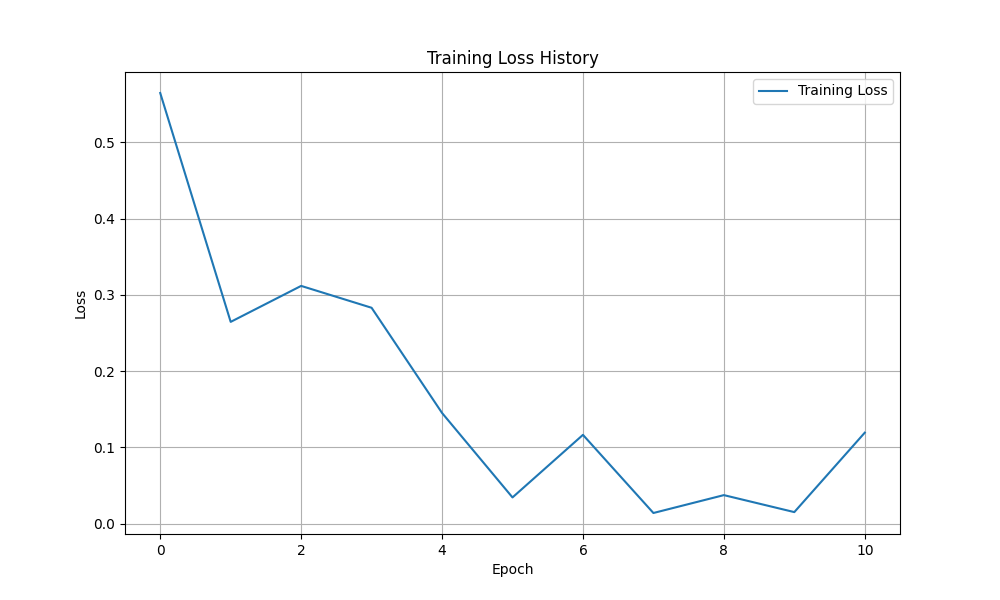
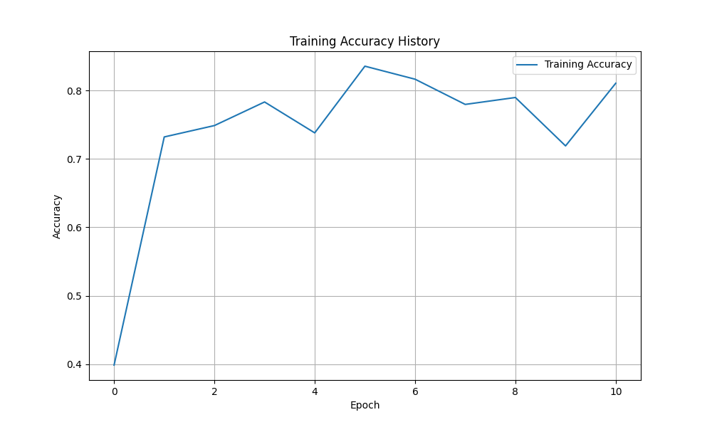

# Fault Recognition

* **`clusterization.ipynb`:** This notebook implements analysis and clustering of pre-cropped defects.

* **`classification_model.ipynb`:** In this notebook, I have trained a convolutional neural network ResNet18 for training defect classification.

* **`model_checkpoint`:** This folder stores the model weights obtained after training in `classification_model.ipynb`.

## `requirements.txt`
Install libraries for successful launching of project:

```
pip install -r requirements.txt
```

## `image_read` Function for reading source data for clustering

Below is the code for the `image_read` function, designed to read images from a given path and return them as a NumPy array.

```python
def image_read(data_path):
  '''
  This function reads .jpg .png images from a directory in NumPy array format.

  Args:
    data_path (str): The path to the directory with the images.

  Returns:
    list: images images array.
  '''
   
  images = []
  with tqdm.tqdm(total=len(os.listdir(data_path))) as pbar:
    for image_path in os.listdir(data_path):
      if image_path.endswith(".jpg") or image_path.endswith(".png"):
        image = cv2.imread(os.path.join(data_path, image_path))

        # resize image and add to array
        images.append(cv2.resize(image, (100, 100)))
         
        pbar.update(1)

  return images
```

## The clustering results are saved in .npy format

Below is the code for saving the image and labels as a NumPy array in .npy format for more convenient work with them in the future.

```python
np.save('images.npy', images)
np.save('labels.npy', cluster_labels)
```
## Clustering results

During the research it was decided to cluster defects into 3 clusters. There are assumptions that each cluster has something like a level of significance of the defect.
Final classes and defect descriptions:

* **Scratches** label 2: defect significance level strong
* **Holes** label 1: defect significance level medium
* **Bulges** label 0: defect significance level weak


## Classification result

For classification it was decided to use ResNet18 and as a metric I took simple accuracy, the model showed quite good results on the test data:

* **Accuracy** 84%


## Visualization of model training





## Visualization of the model architecture as a graph


